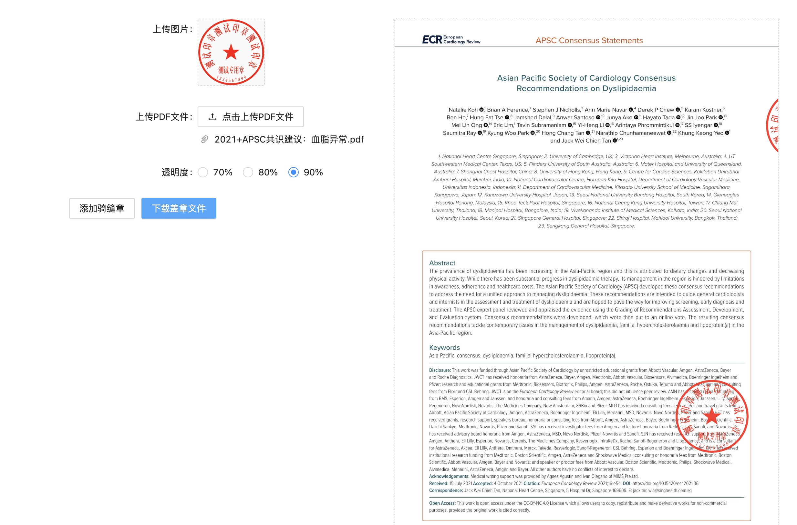

### stitchweb
一个在线盖骑缝章的小程序，可以上传自己的印章png和A4大小的pdf文件，进行盖章。


### 启动
```
docker run -d --name stitchweb -p 8802:80 -v ~/.stitchweb/:/website/upload svcvit/stitchweb:latest
```

### 用法
* 浏览器打开 http://127.0.0.1:8802
* 上传印章，需要是正方形的png文件
* 上传pdf文件，A4大小格式
* 在pdf点击，即可盖章，拖动可以调整位置
* 点击骑缝章，会自动生成骑缝章，拖动可以调整位置
* 翻页，可以在不同地方盖章
* 最后导出pdf文件即可

